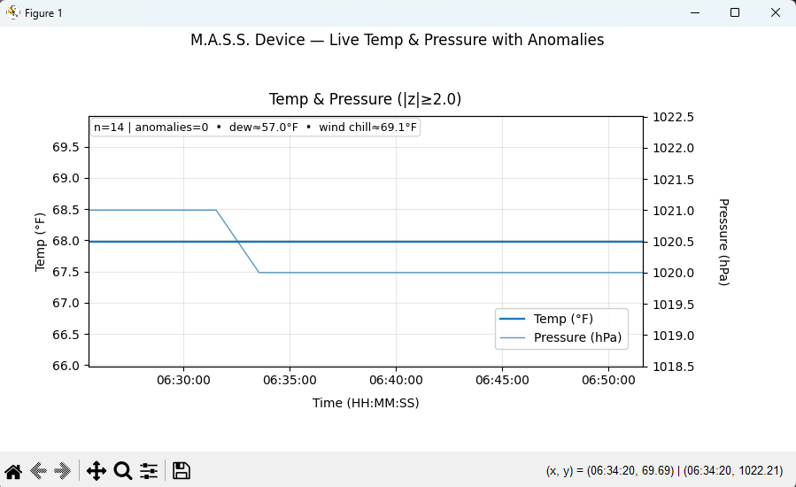

# M.A.S.S. Device (Meteorological Analytics Streaming System)

The M.A.S.S. Device is a real-time streaming pipeline that ingests live weather data, applies rolling analytics (EWMA, z-scores, CUSUM), and visualizes anomalies to deliver timely insights and alerts on rapidly changing atmospheric conditions.


**Short tagline:** Real-time weather analytics & anomaly detection—live.

---

This README.md is the central documentation for the M.A.S.S. Device. It introduces the custom weather-streaming pipeline, describes how messages are ingested, processed, and visualized, and provides clear setup/run instructions.
[]
- Purpose: Demonstrate real-time analytics on streaming meteorological data using Kafka and Python. <br>
- Message flow: Producers emit JSON weather messages, consumers apply rolling statistics (z-scores, EWMA, CUSUM), and anomalies are visualized with Matplotlib animation. <br>
- Run instructions: Included under Quickstart with explicit steps for Windows, macOS/Linux, and WSL. <br>
- Visualization: Dynamic anomaly detection plots make it clear when significant changes occur (e.g., sudden pressure drops). <br>
- Logging: Both producers and consumers will integrate with utils_logger.py so events, anomalies, and errors are tracked in logs/. <br>
- Verification: To finalize, include a screenshot of the animated chart (e.g., saved under assets/) and commit it with your submission. <br>

** Note - his README is a living guide for setup and interpretation of the analytics (why z-scores/EWMA/CUSUM, how to read the visualization, when alerts fire). ** <br>


---

## Introduction
The M.A.S.S. (Meteorological Analytics Streaming System) Device is designed to demonstrate how real-time data streaming and analytics can provide meaningful insights into rapidly changing atmospheric conditions. Weather data, such as temperature, barometric pressure, precipitation, and wind speed, are not only essential for everyday decision-making but also play a critical role in identifying the onset of severe weather events. Streaming pipelines are especially useful in this context because weather processes are dynamic, nonstationary, and require near real-time monitoring to support actionable insights (Allen, Tippett, & Sobel, 2014; McBean, 2011). <br>

At its core, the M.A.S.S. Device combines modern data engineering techniques with time-series analytics. The pipeline ingests live weather data from free APIs, normalizes the messages into a consistent JSON schema, and streams them through Kafka to ensure scalability and resilience. The consumer applies rolling statistical methods such as exponentially weighted moving averages (EWMA), z-scores, and cumulative sum (CUSUM) to detect anomalies. These techniques are widely recommended for anomaly detection in continuous streams because they adapt to variability and identify both abrupt changes and gradual drifts (Chandola, Banerjee, & Kumar, 2009; Page, 1954; Roberts, 1959). <br>

Visualization and interpretability are key to the project’s design. The consumer dynamically renders animated Matplotlib charts that highlight trends and anomalies in weather variables, making complex data streams accessible and understandable. This reflects broader practices in meteorology, where visualization is an indispensable tool for interpreting atmospheric variability and forecasting extreme events (Doswell, 2015). Beyond visualization, the system also includes optional alerting capabilities, sending email or SMS notifications when significant changes occur, such as sharp drops in pressure or unusually high wind gusts. Such features parallel real-world early-warning systems, which are crucial for protecting lives and infrastructure during severe weather (Allen et al., 2014; McBean, 2011). <br>

Ultimately, this project is not just about implementing a streaming system but about demonstrating how data analytics can be applied meaningfully to meteorology. By focusing on interpretability, adaptability, and clarity, the M.A.S.S. Device illustrates the power of analytics in domains where timely and accurate information is essential for decision-making. <br>

### References:
Allen, J. T., Tippett, M. K., & Sobel, A. H. (2014). An empirical model relating U.S. monthly hail occurrence to large-scale meteorological environment. Journal of Advances in Modeling Earth Systems, 7(1), 226–243. https://doi.org/10.1002/2014MS000397 <br>
Chandola, V., Banerjee, A., & Kumar, V. (2009). Anomaly detection: A survey. ACM Computing Surveys, 41(3), 1–58. https://doi.org/10.1145/1541880.1541882 <br>
Doswell, C. A. (2015). Severe convective storms—An overview. Meteorological Monographs, 55(1), 1.1–1.26. https://doi.org/10.1175/AMSMONOGRAPHS-D-15-0001.1 <br>
McBean, G. (2011). Climate change and extreme weather: Designing for adaptation. Philosophical Transactions of the Royal Society A: Mathematical, Physical and Engineering Sciences, 369(1956), 1784–1802. https://doi.org/10.1098/rsta.2010.0370 <br>
Page, E. S. (1954). Continuous inspection schemes. Biometrika, 41(1/2), 100–115. https://doi.org/10.1093/biomet/41.1-2.100 <br>
Roberts, S. W. (1959). Control chart tests based on geometric moving averages. Technometrics, 1(3), 239–250. https://doi.org/10.1080/00401706.1959.10489860 <br>

---

## Features
- Python producer polls a free weather API and publishes normalized JSON to Kafka.
- Python consumer maintains rolling windows, detects anomalies, and animates charts.
- Optional email/SMS alerts (pressure drops, wind gust thresholds, rapid change).
- Clear env configuration; simple, reproducible repo structure.

### Custom Consumer

The custom consumer continuously subscribes to the `weather_live` stream (or falls back to a local JSONL file) and processes each message in real time. Incoming weather observations are parsed into a consistent JSON schema and stored in rolling windows for variables such as temperature and pressure. Within these windows, the consumer calculates statistical indicators like z-scores to identify anomalies, with extensions planned for exponentially weighted moving averages (EWMA) and cumulative sum (CUSUM) methods to capture gradual regime shifts. The processed data are rendered in an animated Matplotlib visualization, where temperature and pressure trends are plotted in real time and anomalies are highlighted with distinct markers. This design ensures that the consumer not only ingests and processes data but also transforms the raw stream into interpretable, actionable insights that clearly illustrate short-term atmospheric changes as they unfold.

Below is the animated consumer visualization showing temperature (°F) and pressure (hPa) over time with anomalies highlighted:


---

## Project Structure

```text
mass_device/
| - | - consumers/
|       | - demo_mass_device_consumer.py
|       | - mass_device_alerts.py
|       | - mass_device_consumer.py
| - data/
|     | - db/
|         | - alerts,jsonl
|         | - consumer_stream.josnl
|         | - weather_stream.josnl
|     | - demo_stream.josnl
| - image/
| - logs/
|     | - demo_consumer.log
|     | - demo_producer.log
|     | - mass_device_alerts.log
|     | - mass_device_consumer.log
|     | - mass_device_producer.log
| - meteorological_theories/
|     | - _init_.py
|     | - demo_calc.py
| - producers/
|     | - demo_mass_device_producer.py
|     | - mass_device_producer.py
| - utils/
|     | - kafka.io.py
|     | - rolling_stats.py
|     | - utils_env.py
|     | - utils_jsondb.py
|     | - utils_logger.py
| - .env.example
| - .gitignore
| - LICENSE
| - pyproject.toml
| - README.md
| - requirements.txt
| - setup.cfg
```

---

## Requirements

- **Python:** 3.11 (enforced via `pyproject.toml` or `python_requires`)
  - Verify inside venv: `python -V` → `Python 3.11.x`
- **Operating System:** Windows 11 (22H2/24H2) or macOS 12+ / Linux (x86_64)
- **Kafka:** Local or remote broker (e.g., Apache Kafka 3.x) reachable at `KAFKA_BOOTSTRAP_SERVERS`
  - Default assumption: `localhost:9092`
  - Topic: `weather_live` (created automatically by broker if auto-create is enabled; otherwise create manually)
- **Network/Ports:** Ensure the client can reach the Kafka broker port (default 9092)
- **Python packages:** Listed in `requirements.txt` (install inside the venv)
- **Environment variables:** Configure via `.env` (copy from `.env.example`)
  - `WEATHER_API_BASE` (e.g., Open-Meteo), `LOCATION_LAT`, `LOCATION_LON`, `POLL_SECONDS`
  - `KAFKA_BOOTSTRAP_SERVERS`, `KAFKA_TOPIC`, `KAFKA_CLIENT_ID`, `KAFKA_GROUP_ID`
  - Optional alerts: `ALERTS_ENABLED`, `ALERT_PRESSURE_DROP_HPA`, `ALERT_WIND_GUST_MPS`, `ALERT_COOLDOWN_MIN`
  - Optional email/SMS: `SMTP_HOST`, `SMTP_PORT`, `SMTP_USER`, `SMTP_PASS`, `ALERT_EMAIL_TO`, `ALERT_EMAIL_FROM`, and/or SMS gateway/API keys

---

### Recommended tooling

- **Windows PowerShell** (for commands in this README)
- **VS Code** with extensions:
  - Python, Pylance
  - Ruff or Black (formatting/linting)
  - dotenv (syntax highlighting for `.env`)
- **Git** (2.39+) for version control


### Optional enforcement of Python 3.11
Add one of the following to the repo to make the Python version explicit:

**Option A – `pyproject.toml`**
```bash
[project]
name = "mass_device"
version = "0.1.0"
requires-python = ">=3.11,<3.12"
```


**Option B – `setup.cfg`**
```bash
[metadata]
name = mass_device
version = 0.1.0

[options]
python_requires = >=3.11,<3.12
```


**Option C - `.python-version`**
```bash
3.11.9
```


**Quick Verification**
```bash
# Verify Python version in the venv
python -V

# Verify key environment variables are present
python - <<'PY'
import os
vars = [
  "WEATHER_API_BASE","LOCATION_LAT","LOCATION_LON","POLL_SECONDS",
  "KAFKA_BOOTSTRAP_SERVERS","KAFKA_TOPIC","KAFKA_CLIENT_ID","KAFKA_GROUP_ID"
]
missing = [v for v in vars if not os.getenv(v)]
print("Missing:", missing if missing else "None")
PY
```

---

## Tasks
1. Clone / open the project in VS Code.
2. Create & activate a Python 3.11 virtual environment.
3. Install dependencies from requirements.txt.
4. Create .env and set API_KEY=... (keep it off GitHub).
5. Run the consumer and verify the live chart updates.
6. Commit & push your changes, include a screenshot for submission.

---

## Quickstart

## 1 Create & Activate venv

### Windows
```shell
# If you have multiple Pythons installed, prefer py -3.11:
py -3.11 -m venv .venv
# Fallback (if 'py' not available and 'python' already points to 3.11):
# python -m venv .venv
.\.venv\Scripts\Activate.ps1
```

### macOS/Linux
```bash
# Use the 3.11 interpreter explicitly if available:
python3.11 -m venv .venv
# Fallback if python3.11 not on PATH but python3 is 3.11:
# python3 -m venv .venv
source .venv/bin/activate
```

### Check Version
```bash
python -V   # should report Python 3.11.x inside the venv
```


## 2 Install Dependencies

### Windows
```shell
python -m pip install --upgrade pip
pip install -r requirements.txt
```

### macOS/Linux
```bash
python3 -m pip install --upgrade pip
pip install -r requirements.txt
```


## 3 Configure environment

### Windows
```shell
# PowerShell supports cp, but Copy-Item is explicit:
Copy-Item .env.example .env
# Edit .env with your keys, location, and Kafka bootstrap servers.
```

### macOS/Linux
```bash
cp .env.example .env
# Edit .env with your keys, location, and Kafka bootstrap servers.
```

## .env Important Keys
```bash
# --- Weather provider selection ---
# Choices: open-meteo (no key, fast) | openweather (requires OPENWEATHER_API_KEY)
WEATHER_PROVIDER=open-meteo

# Location (Maryville, MO)
LOCATION_LAT=40.3467
LOCATION_LON=-94.8725

# Producer cadence (seconds)
POLL_SECONDS=60

# --- OpenWeatherMap (only if WEATHER_PROVIDER=openweather) ---
OPENWEATHER_API_KEY=REPLACE_ME
OPENWEATHER_BASE=https://api.openweathermap.org/data/2.5/weather
OPENWEATHER_UNITS=metric

# --- Kafka (optional) ---
KAFKA_BOOTSTRAP_SERVERS=localhost:9092
KAFKA_TOPIC=weather_live
KAFKA_GROUP_ID=mass_device

# --- Alerts ---
ALERTS_ENABLED=true
ALERT_PRESSURE_DROP_HPA=3
ALERT_WIND_GUST_MPS=15
ALERT_COOLDOWN_MIN=30

# --- Email via Brevo SMTP ---
SMTP_HOST=smtp-relay.brevo.com
SMTP_PORT=587
SMTP_USER=your-smtp-login@smtp-brevo.com
SMTP_PASS=your-long-smtp-key
ALERT_EMAIL_FROM=your_verified_sender@example.com
ALERT_EMAIL_TO=you@example.com
```
### To switch providers later, just change `WEATHER_PROVIDER=open-meteo` switch which one has the "#" before it `openweather` (and set the OWM key if needed).

### API Key Hygiene (don’t commit secrets)
- Store the key in .env (and/or secrets/), both are git-ignored.
- Never hard-code your key in .py files.
- If you rotate keys, just update .env.

## 4 Run Producer (Terminal One (1))

### Windows/macOS/Linux
```bash
python -m producers.mass_device_producer
```
- With Kafka up, it publishes to weather_live.
- Without Kafka, it still works—writes to data/demo_stream.jsonl.


## 5 Run Consumer (Terminal Two (2))

### Windows/macOS/Linux
```bash
python -m consumers.mass_device_consumer
```
- FIRST record is logged immediately, then every 10th message.
- Animated chart shows Temp (°F) + Pressure (hPa) with anomalies marked.
- Every consumed message is appended to data/db/consumer_stream.jsonl.
- Alerts (when triggered) are appended to data/db/alerts.jsonl and emailed if ALERTS_ENABLED=true.

---

## Weather Providers
- Open-Meteo (default): free, no API key, fast updates.
    - Set WEATHER_PROVIDER=open-meteo

- OpenWeatherMap: requires API key.
  - Set WEATHER_PROVIDER=openweather and OPENWEATHER_API_KEY=...
  - OWM “current weather” updates are typically ~10 min; don’t expect sub-minute changes.

---

## Brevo (Sendinblue) SMTP Setup
### 1 Create account at brevo.com → verify your email.
### 2 Go to Senders & Domains → add/verify your sender (the same address you put in ALERT_EMAIL_FROM).
### 3 Go to SMTP & API → SMTP tab:
  - Copy SMTP login (looks like xxxx@smtp-brevo.com) → put in SMTP_USER.
  - Generate a SMTP key → put the entire string in SMTP_PASS.

In .env, set:
```bash
SMTP_HOST=smtp-relay.brevo.com
SMTP_PORT=587
SMTP_USER=xxxx@smtp-brevo.com
SMTP_PASS=your-long-smtp-key
ALERT_EMAIL_FROM=verified_sender@example.com
ALERT_EMAIL_TO=you@example.com
```

### 5 Save .env (never commit credentials).

### Quick email test (PowerShell)
```shell
$code = @"
from consumers.mass_device_alerts import maybe_send_alert
fake = {
  "ts_iso":"2025-09-30T03:45:00Z","provider":"brevo-test",
  "lat":40.3467,"lon":-94.8725,"temp_c":23.0,"pressure_hpa":1019.5,
  "humidity_pct":55,"wind_mps":3.1,"gust_mps":5.0,"z_score":2.4,
  "reason":"Test anomaly"
}
maybe_send_alert(fake)
print("Sent Brevo test alert (check inbox).")
"@
$code | python -
```
- If you don’t see it, check spam, confirm sender verification, and recheck SMTP_USER/SMTP_PASS.

---

## JSON “Database” Files
- data/db/consumer_stream.jsonl – every consumed message (append-only)
- data/db/alerts.jsonl – alert rows (reason, thresholds, snapshot of values)

You can load these into pandas later:
```shell
import json, pandas as pd
df = pd.DataFrame([json.loads(l) for l in open("data/db/alerts.jsonl", "r", encoding="utf-8")])
print(df.tail())
```

---

## Troubleshooting
- Venv sanity: 
```bash
python -V, where python (Windows) / which python (WSL)
```

- Kafka sanity: 
```shell
kafka-topics.(bat|sh) --list --bootstrap-server localhost:9092
```

- Chart freezes / “Not Responding”
The consumer uses a background ingest thread and FuncAnimation to keep the UI responsive. If your machine is busy, lower the animation interval or window size: <br>
    - In code: FuncAnimation(..., interval=250) and set WINDOW_POINTS=120 (or 60) in .env.

- Right Y-axis label clipped
We already reserve right-side space via:
```shell
fig.tight_layout(rect=(0.06, 0.12, 0.86, 0.90))
ax2.set_ylabel("Pressure (hPa)", labelpad=18)
```
Adjust rect or labelpad if needed.

- No Kafka
The system runs fine without Kafka—producer writes JSONL, consumer tails it.

- OWM looks “slow”
That’s expected; their “current” endpoint updates roughly every 10 minutes. If you need faster, stick with Open-Meteo for development.

---

## Authors

Contributors names and contact info <br>
@github.com/Data-Git-Hub <br>

---

## Version History
- P6 Finl 7.1 | Add 7.4.F.png; Modify README.md
- P6 Finl 7.0 | Modify README.md
- P6 Main 6.4 | Modify mass_device_consumer.py - change parameters of Figure 1 to include all axes titles, README.md
- P6 Main 6.3 | Modify .env, .env.example, README.md
- P6 Main 6.2 | Modify mass_device_consumer.py - restoring functionality back to app, README.md
- P6 Main 6.1 | Modify mass_device_consumer.py - help render the graph better, README.md
- P6 Main 6.0 | Modify mass_device_consumer.py - help render the graph better, README.md
- P6 Main 5.2 | Modify mass_device_alerts.py - change so the path for the .env is loaded, README.md
- P6 Main 5.1 | Modify mass_device_alerts.py, README.md
- P6 Main 5.0 | Add utils_jsondb.py;  Modify mass_device_producer.py, mass_device_consumer.py, README.md
- P6 Main 4.7 | Modify mass_device_producer.py, .env - changed the refresh rate at 60 sec, README.md
- P6 Main 4.6 | Modify mass_device_producer.py - Changed to emit more often, in lieu of every 5 minutes to actual, README.md
- P6 Main 4.5 | Modify mass_device_producer.py - Changed def fetch_openweather to allow for the API key to work correctly, README.md
- P6 Main 4.4 | Modify mass_device_consumer.py - Corrected issues with Figure 1 disappearing, README.md
- P6 Main 4.3 | Add .env - Add API key, Modify README.md
- P6 Main 4.2 | Modify .env.example, README.md
- P6 Main 4.1 | Modify mass_device_consumer.py - Add consume streaming data, README.md
- P6 Main 4.0 | Modify mass_device_producer.py - Add live streaming data, README.md
- P6 Main 3.9 | Modify demo_mass_device_consumer.py - change x-axis title placement, README.md
- P6 Main 3.8 | Modify demo_mass_device_consumer.py - change legend placement, README.md
- P6 Main 3.7 | Modify demo_mass_device_consumer.py - changing temperature to fahrenheit, README.md
- P6 Main 3.6 | Modify demo_mass_device_consumer.py - changing current output graphic to not conceal title, README.md
- P6 Main 3.5 | Modify demo_mass_device_consumer.py, README.md
- P6 Main 3.4 | Modify README.md
- P6 Main 3.3 | Add meteorological_theories folder, demo_calc.py - to have a place to do updates for formulas as a demo; Modify README.md
- P6 Main 3.2 | Modify README.md - Formatting
- P6 Main 3.1 | Modify README.md - Formatting
- P6 Main 3.0 | Modify README.md - Formatting
- P6 Main 2.5 | Modify README.md - added paragraph for additional clarity on mass_device_consumer.py
- P6 Main 2.4 | Modify mass_device.py, mass_device_consumer - copied demo over to use as base, mass_device_alerts - made some basic alerts, kafka.io.py, rolling_stats.py, utils_env.py, util_logger.py, README.md
- P6 Main 2.3 | Add image folder - for adding images to the README.md; Modify README.md - Formatting
- P6 Main 2.2 | Modify README.md - updated Project Structure
- P6 Main 2.1 | Modify README.md
- P6 Main 2.0 | Modify README.md
- P6 Main 1.2 | Modify README.md
- P6 Main 1.1 | Modify README.md
- P6 Main 1.0 | Add demo_mass_device_consumer.py, demo_mass_device_producer.py; Modify README.md
- P6 Init 0.5 | Modify README.md
- P6 Init 0.4 | Added folders named: consumers, data, logs, producers - Added files: mass_device_alerts.py, mass_device_consumer.py, mass_device_producer.py, kafka_io.py, rolling_stats.py, utils_env.py, utils_logger.py; Modify README.md 
- P6 Init 0.3 | Modify README.md - Added Introduction
- P6 Init 0.2 | Modify README.md
- P6 Init     | Add requirements.txt, pyproject.toml, setup.cfg; Modify .gitignore, README.md


## Test History
- P6 Test 1.0 | Test demo_mass_device_consumer.py - Access to folder for formulas for easier modification later in design: TEST - FAIL incorrect folder referencing
- P6 Test 1.1 | Test demo_mass_device_consumer.py - Access to folder for formulas for easier modification later in design: TEST - SUCCESS
- P6 Test 2.0 | Test demo_mass_device_consumer.py - Confirm change in output graphic and fahrenheit temperature measurements: TEST - FAIL need to fix legend on graphic still, - SUCCESS conversion to fahrenheit
- P6 TEST 2.1 | Test demo_mass_device_consumer.py - Confirm change in output graphic: TEST - SUCCESS
- P6 Test 2.2 | Test demo_mass_device_consumer.py - Confirm change in output graphic: TEST - SUCCESS
- P6 Test 3.0 | Test mass_device_producer.py, mass_device_consumer.py: TEST - FAIL consumer didn't process any data
- P6 Test 3.1 | Test mass_device_producer.py, mass_device_consumer.py: TEST - SUCCESS need to check openweather API key
- P6 Test 3.2 | Test mass_device_producer.py, mass_device_consumer.py: TEST - FAIL OpenWeatherMap API Key isn't activated, need to wait for API activation email
- P6 Test 3.3 | Test mass_device_producer.py. mass_device_consumer.py: TEST - FAIL
- P6 Test 3.4 | Test mass_device_producer.py. mass_device_consumer.py: TEST - FAIL Modifying refresh rate
- P6 Test 3.5 | Test mass_device_alerts.py: TEST - PASS Successful sent email alert to University account
- P6 Test 4.0 | Test mass_device_consumer.py: TEST - FAIL Stall still from the graphic rendered
- P6 Test 4.1 | Test mass_device_consumer.py: TEST - SUCCESS Fix stalling of graphic rendered
- P6 Test 4.2 | Test mass_device_consumer.py: TEST - SUCCESS Fixed all axes titles

## Final Notes
- Keys live only in .env (.gitignore)
- The `consumer` logs FIRST... immediately when the first record arrives as a validity check
- Time on teh X-axis is `local timezone` (incoming timestamps are UTC and converted)